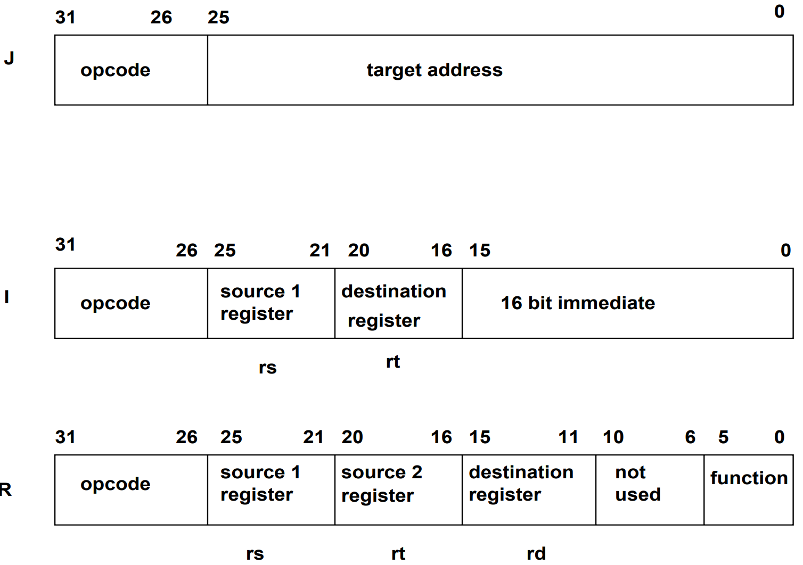
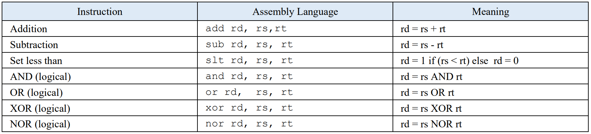
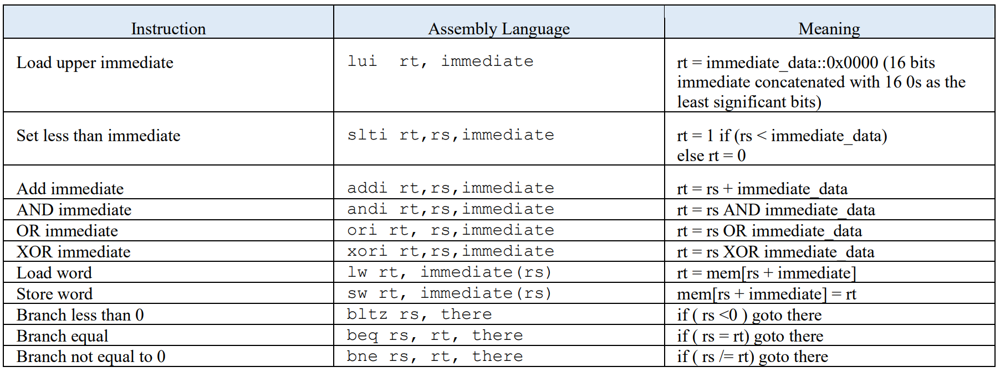
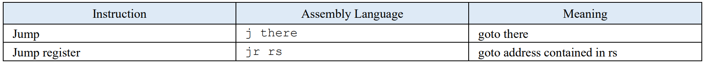
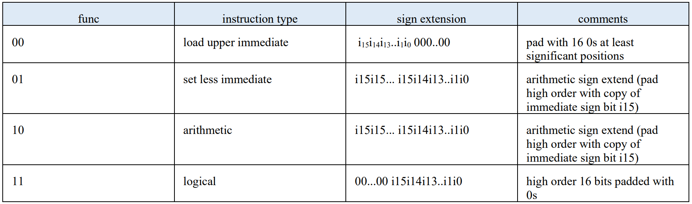
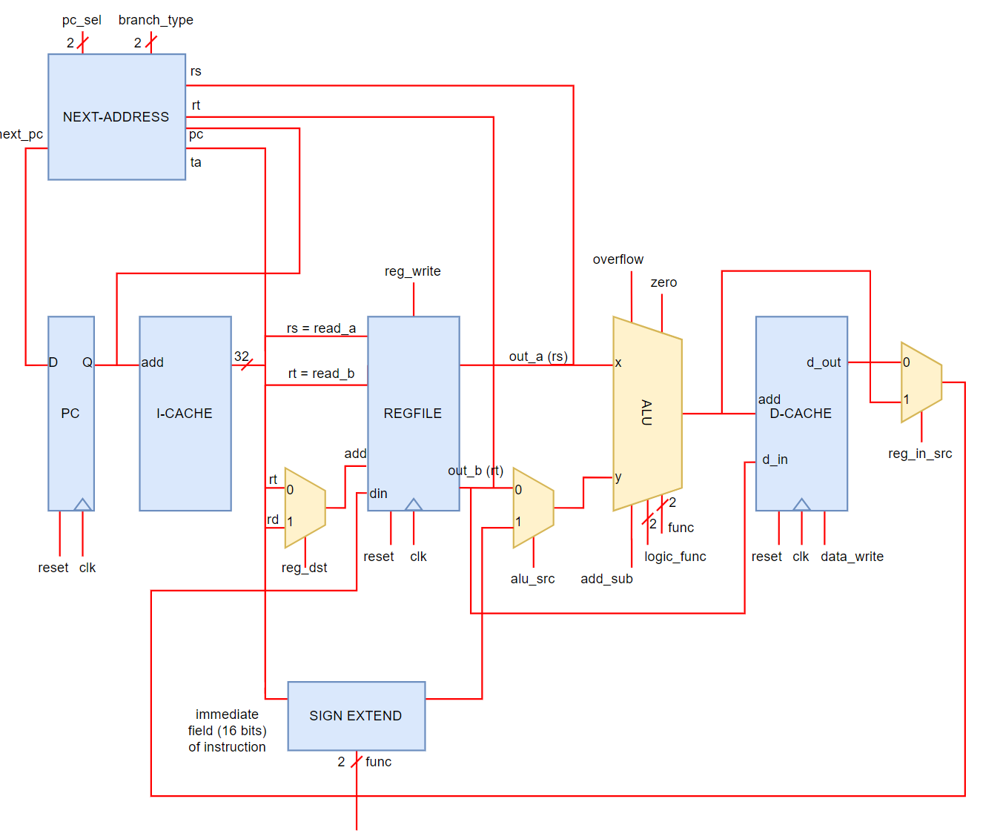

# MIPS CPU
This project consists of the design and development of a MIPS processor using VHDL. The processor contains 20 instructions divided into three categories: R (register) , I (Immediate) and J (Jump) instructions.

## Instruction Formats

#### Register Instructions

#### Immediate Instructions

#### Unconditional Jump Instructions

## Sign Extension Formats
Some of the MIPS instructions require that the 16-bit immediate field (stored in bits 0 to 15) of I format instructions be sign extended to a full 32-bit width. The exact manner of this sign extension depends upon the type of instruction to be executed, as illustrated below.

## Datapath Design

## Component Description

### PC Register
The program counter register is a 32-bit wide register with an asynchronous reset. The input to the PC register is the output of the next-address unit. The output of the PC register ( the low-order 5 bits in order to reduce the size of the instruction cache memory) is used as the address input to the instruction cache memory. The (full 32 bit) output of the PC is also an input to the next-address unit.

### Next-Address Unit
Responsible for generating the next address to be fed to the program counter. This next address depends on the instruction (whether a regular increment of +1, or a branch/jump).

### Instruction Cache (I-cache)
The I-cache unit stores the program machine code. It is a 32 location read-only memory (ROM) consisting of a 5-bit wide address input and a 32-bit wide data output (consisting of the 32 bits of machine code for the instruction stored at the addressed location).

### Register File
Register file for reading/writing into registers.

### ALU
Arithmetic-logic-unit for selecting between addition, subtraction, logical operation, etc.

### Sign-Extender
As discussed previously, Some of the MIPS instructions require that the 16-bit immediate field (stored in bits 0 to 15) of the instruction be sign extended to a full 32-bit width.

### Data Cache (D-Cache)
The data cache acts as a small RAM -type of memory. The low order 5 bits of the ALU output are used to address one of 32 locations (each location is 32 bits wide).
